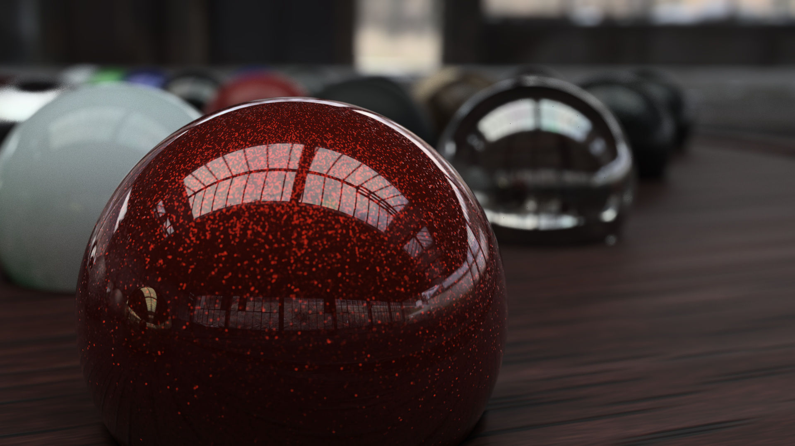
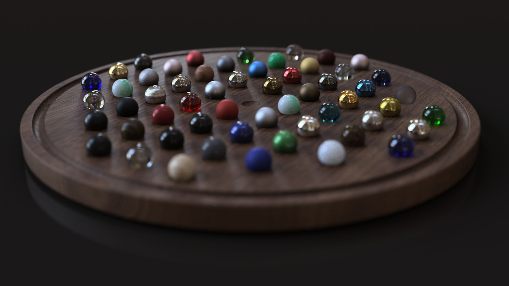

# changing PRISM materials 

Github: [DEMO](https://wallabyway.github.io/material-change-prism/)  /   [SRC](https://github.com/wallabyway/material-change-prism)

#### Introduction

I recently built a Doors/Windows configurator that allowed customers to change the wood and framing geometry using the Forge Viewer and Fusion360 models.  The tricky part was changing materials faithfully... let me explain...
 
Changing materials in Forge Viewer has been some-what limited to a few colors and textures - basically the old R71 three.js Phong shader.  There was no concept of IBL (image based lighting) or PBR materials.

In this blog post, we'll build a simple configurator that changes the wood materials on a toy plane.  It will use materials based on the Fusion and Revit appearance library, called 'Prism' materials.

#### Prism Material Primer
Prism materials are PBR materials based on the Disney Paper and were first introduced in this presentation at Autodesk University here.  There are over 500 fixed Prism materials, like pine-wood, carbon-fiber, red-specle-car-paint and frosted glass... all based on 4 primary shaders... Opaque-Dielectric, Transparency, Metal and Layered.

<a href="https://gallery.autodesk.com/projects/115106/fusion-360-material-spheres?searched=">
> Red Specle Car Paint > 
> Lots of materials

(Fusion360 design, rendered with Cloud Renderer)
</a>

#### 3D Wood and the ToyPlane
The toy plane was designed in Fusion 360, and wood materials were applied to it's surface.  The configurator allows you change these wood materials for a different material, based on what you select on the right.

To do the material change, we need to supply a list of FragIDs and a material object.

The FragIDs come from a simple text search here:

The Material shader comes from a Prism helper library.  We provide a material 'schema' containing all the parameters to create the PBR prism shader.

In this demo, we are going to focus on 5 demo materials, that show off the base materials.  By tweaking these parameters, and supplying any the right textures, you can make any prism material!

### References
- [JELDWIN product example](http://www.jeld-wen.com/en-us/products/windows/styles/double-hung/custom-wood-double-hung-window)

- [Philipp's CAT configurator POC](https://github.com/Autodesk-Forge/forge-rcdb.nodejs/blob/34fa81b94a400454ef48d475dd9cfe417460eff3/src/client/viewer.components/Viewer.Extensions.Dynamic/Viewing.Extension.CAT/Viewing.Extension.CAT.js)
- [Blog - Material Change](https://forge.autodesk.com/cloud_and_mobile/2015/03/add-material-to-built-in-object-in-viewer-by-autodesk-view-data-api.html)
- [Blog - object search](https://forge.autodesk.com/blog/make-shader-face-room-object-model)